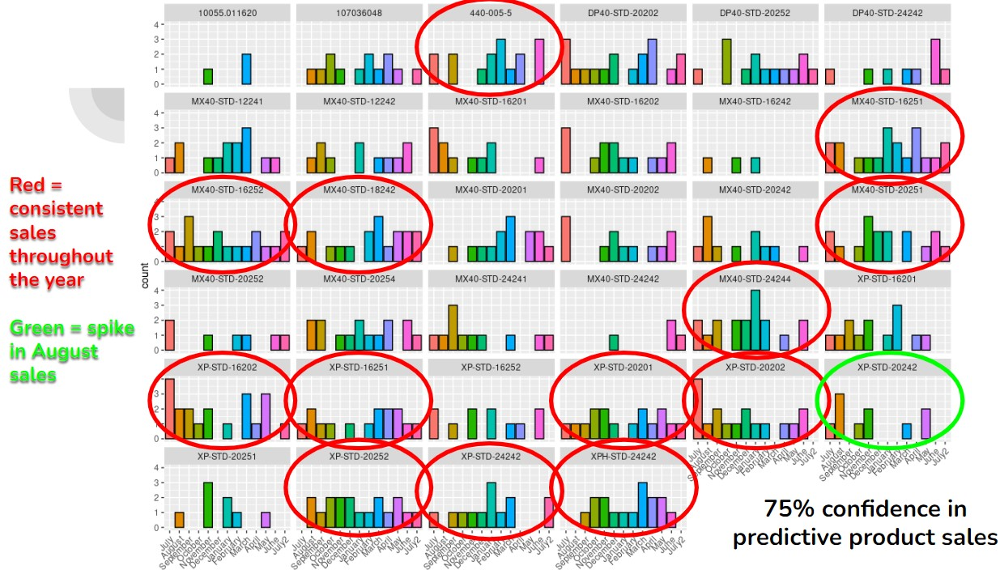
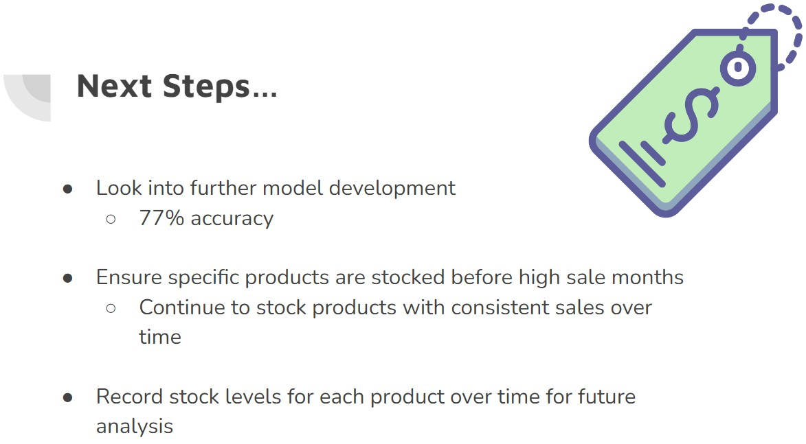

```{r setup, include=FALSE}
knitr::opts_chunk$set(echo = TRUE)
```


## Course Objective 1
#### Describe probability as a foundation of statistical modeling, including inference and maximum likelihood estimation

*From Activity 6 - Logistic Regression*

```{r chunk1}
#load library
library(tidyverse)
library(tidymodels)
```

```{r chunk2}
#read in data from URL
resume <- read_csv("https://www.openintro.org/data/csv/resume.csv")
```

```{r chunk3}
#coerce variable of interest to binary
resume$received_callback <- factor(resume$received_callback)
```

```{r chunk4}
# probability of getting a callback
prob_yes = 392/4870
prob_yes

odds_yes = (prob_yes/ (1-prob_yes))
odds_yes
```

**Logistic Regression**
```{r}
resume_mod <- logistic_reg() %>%
  set_engine("glm") %>%
  fit(received_callback ~ race, data = resume, family = "binomial")

tidy(resume_mod) %>% 
  knitr::kable(digits = 3)
```

```{r}
#log odds of perceived black person getting callback
log_odds_callback = -2.68

odds_callback = exp(log_odds_callback)
odds_callback
```

## Discussion & Reflection

The logistic regression assignment was a good way to learn about probability, odds, and the roll they play while building models. In this assignment, we analyzed at a data set that looked at the influence of race and gender on the probability of a person receiving a callback after a job interview solely based on their name. We saw that, despite many of the candidates having very good credentials (i.e. a high number of years of experience), that there were a very low number of callbacks given to anyone. When we further looked at black individuals, we saw that the callback probability decreased even more. 

I thought that this data set was enlightening in a few ways. One, that you may disproportionately not be given a job opportunity solely based on your name and its perception of race or gender to another person. That level of discrimination, while illegal, does still occur as revealed by this study. As a female, that knowledge is disheartening. I can't even image what a person of color might experience. I think it's important to acknowledge your own biases and actively work to avoid them. This data set, in a roundabout way, helped me to think about that in a more present sense. 

---

## Course Objective 2
#### Determine and apply the appropriate generalized linear model for a specific data context

*From Mini Competition 2*

```{r}
library(tidyverse)
raw_data <- read_csv("inventory.csv")
```

```{r}
#convert week data by month #easier for interpretation
data_month <- raw_data %>% mutate(Month = case_when(week <= 4 ~ 'July',
                                                    week > 4 & week <= 8 ~ 'August',
                                                    week > 8 & week <= 12 ~ 'September',
                                                    week > 12 & week <= 16 ~ 'October',
                                                    week > 16 & week <= 20 ~ 'November',
                                                    week > 20 & week <= 24 ~ 'December',
                                                    week > 24 & week <= 28 ~ 'January',
                                                    week > 28 & week <= 32 ~ 'February',
                                                    week > 32 & week <= 37 ~ 'March',
                                                    week > 37 & week <= 41 ~ 'April',
                                                    week > 41 & week <= 45 ~ 'May',
                                                    week > 45 & week <= 50 ~ 'June',
                                                    week > 50 & week <= 53 ~ 'July2',))

data_month$Month <- factor(data_month$Month, levels = c("July", "August", "September",
                                                        "October", "November", "December",
                                                        "January", "February", "March",
                                                        "April", "May", "June", "July2"))
data_month$item_no <- factor(data_month$item_no)
```


```{r}
#add binary info
data_month_bi <- data_month %>% mutate(sold_binary = case_when(sold > 0 ~ '1',
                                                    TRUE ~ '0' ))

data_month_bi$sold_binary <- as.numeric(data_month_bi$sold_binary)
```


```{r}
data_wider <- data_month %>% pivot_wider(names_from = item_no,
                                    values_from = sold)

data_wider
```


```{r}
#see overall trends across time
ggplot(data = data_month, aes(x = Month,
                             y = sold,
                             color = item_no,
                             fill = item_no)) +
  geom_col() + 
  theme_bw() +
  theme(panel.grid.major = element_blank(), 
        panel.grid.minor = element_blank(), 
        legend.position = "none")
```


```{r}
summary(data_month_bi)
```


```{r}
#install.packages("caTools")
library(caTools)
set.seed(123)
split_data <- sample.split(data_month_bi$sold, SplitRatio = 0.7)

test_data <- subset(data_month_bi, split_data == FALSE)

train_data <- subset(data_month_bi, split_data == TRUE)
```


```{r}
#model 1
fit <- glm(sold_binary ~ Month + item_no, data=train_data, family=binomial())
```

```{r}
set.seed(123)
split_data2 <- sample.split(data_month$sold, SplitRatio = 0.7)

test_data2 <- subset(data_month, split_data2 == FALSE)

train_data2 <- subset(data_month, split_data2 == TRUE)

fit2 <- glm(sold ~ Month + item_no, data = train_data2)

```


```{r}
library(broom)

model <- tidy(fit)
options(scipen = 999)
model
```

```{r}
sig <- subset(model, p.value < 0.05)
print(sig, n = 10)
```

```{r}
#predictions
test_data$prob <- predict(fit, test_data, type="response")

test_data$pred <- test_data %>% mutate(ifelse(prob > .75, "1", "0"))
```

```{r}
accuracy <- mean(head(test_data$pred$`ifelse(prob > 0.75, "1", "0")`, 35)
                 == head(test_data$sold_binary, 35))
accuracy #77% accuracy
```


```{r}
#predictions for fit2
test_data2$prob <- predict(fit2, test_data2, type="response")

test_data2$pred <- test_data2 %>% mutate(ifelse(prob > .75, "1", "0"))
```

```{r}
accuracy2 <- mean(head(test_data2$pred$`ifelse(prob > 0.75, "1", "0")`, 35)
                  == head(test_data2$sold, 35))
```


```{r}
#what is our second model predicting at?
accuracy2 #2% accuracy
```

*Our first model is predicting with 77% accuracy*

## Discussion & Reflection
Mini competition 2 set the goal to create a model to complete the task of projecting a company’s sales of widgets and then communicate our findings to a general audience. In this example, we utilized a generalized linear model approach to accomplish this task and framed the output in terms of months of projected high sales. This way, the company was able to use our predictions to choose which widgets should be kept in excess stock during specific months. One of the main goals of this assignment was to intentionally frame the output and predictions in a manner that is easily digestible to people who are not formally trained in statistics. A challenge of this goal was to strike a balance between effective communication without condescension- this is often a critique which non-academics have with academia. 

One problem with our approach to the generalized linear model was with our training and testing models. While we randomized the dataset and split our data into a 70:30 training and testing sets, this ignores the collinearity of the data. For example, it is possible that one widget over multiple months could have been selected for either the training or testing sets. To ensure an even separation of widgets, a better approach would have been to select by unique widget and then subset the data. This project stretched my thinking about a problem, not only in what approach to use, but also how to effectively communicate the findings to a general audience

---

## Course Objective 3
#### Conduct model selection for a set of candidate models

*From Mini Competition 1*

```{r}
library(tidyverse)
library(broom)
library(ggplot2)
library(tidymodels)
library(GGally)
library(olsrr)
```


```{r}
challenge_data <- readr::read_csv("2019_data.csv")
```


```{r creating variables vector}
selected_vars <- c("FSSPORTX", "FSVOL", "FSMTNG", "FSPTMTNG", "FSFUNDRS", 
                   "FSCOMMTE", "FSCOUNSLR", "FSFREQ","FSATCNFN", "FHCHECKX", 
                   "FHHELP", "FHPLACE", "SCCHOICE", "SPUBCHOIX",  "SEGRADES", 
                   "SCONSIDR")
```


```{r creating new dataset}
#create a new data set
new_data <- challenge_data[, selected_vars]
```


```{r selecting variable values}
filtered_data <- new_data %>%
  filter(if_all(c("FSSPORTX", "FSVOL", "FSMTNG", "FSPTMTNG", "FSFUNDRS",
                  "FSCOMMTE","FSCOUNSLR","FSATCNFN", "FHPLACE", "SCCHOICE",
                  "SCONSIDR", "SPUBCHOIX"), ~. %in% c(1, 2)))
```


```{r creating binary variables yes and no values}
filtered_data2 <- filtered_data %>%
  mutate(across(c("FSSPORTX", "FSVOL", "FSMTNG", "FSPTMTNG", "FSFUNDRS", 
                  "FSCOMMTE", "FSCOUNSLR", "FSATCNFN", "FHPLACE", "SCCHOICE", 
                  "SPUBCHOIX", "SCONSIDR"), ~ifelse(. == 1, "Yes", "No")))
```

```{r}
filtered_data3 <- filtered_data2 %>%
  mutate(FHHELP = case_when(
    FHHELP %in% c(1, 2) ~ "few",  # Combine 1's and 2's into 1 (pass)
    FHHELP %in% c(3, 4) ~ "many",   # Combine 3's and 4's into 0 (fail)
    TRUE ~ NA_character_            # Set other values (including 5) to NA
  )) %>%
  filter(!is.na(FHHELP)) 
```


```{r}
filtered_data4 <- filtered_data3 %>%
  mutate(FHCHECKX = case_when(
    FHCHECKX %in% c(1, 2) ~ "few",  # Combine 1's and 2's into 1 (pass)
    FHCHECKX %in% c(3, 4) ~ "many",   # Combine 3's and 4's into 0 (fail)
    TRUE ~ NA_character_            # Set other values (including 5) to NA
  )) %>%
  filter(!is.na(FHCHECKX)) 
```

```{r splitting data}
## Splitting data into train and test and fitting the model
# set seed before random split
set.seed(40)
# put 80% of the data into the training set
data_split <- initial_split(filtered_data4, prop = 0.80)

# assign the two splits to data frames - with descriptive names
data_train <- training(data_split)
data_test <- testing(data_split)

# splits
data_train
```

**Fitting the model**

```{r fitting_initialmodel}
#fit the mlr model
lm_spec <- linear_reg() %>%
set_mode("regression") %>%
set_engine("lm")

initial_model <- lm_spec %>% 
fit(SEGRADES ~ FSSPORTX+FSVOL+FSMTNG+FSPTMTNG+FSATCNFN+FSFUNDRS+FSCOMMTE+
      FSCOUNSLR+FSFREQ+SCCHOICE+SPUBCHOIX+FHCHECKX+FHHELP+FHPLACE+
      FSMTNG*FHHELP+FSPTMTNG*FHHELP+SCONSIDR, data = data_train)

stats<- tidy(initial_model)
```

**Final models**
```{r}
final_model1 <- lm_spec %>% 
fit(SEGRADES ~ FSSPORTX+FSATCNFN+FHCHECKX+FHHELP+FSMTNG*FHHELP+FSMTNG+
      FSCOMMTE+SCCHOICE+FHPLACE, data = data_train)

tidy(final_model1)
```


```{r}
#final model chosen after the backward selection using AIC values
final_model2 <- lm_spec %>% 
fit(SEGRADES ~ FSSPORTX+FSATCNFN+FHCHECKX+FHHELP+FSMTNG*FHHELP+FSMTNG+
      FSCOMMTE+SCCHOICE+FHPLACE+FSFUNDRS, data = data_train)

tidy(final_model2)
```


**final_model1**
```{r}
## Making  predictions and check for accuracy of predictions
predictions <- predict(final_model1, new_data = data_test)
```


```{r}
#check accuracy of the  predictions
true_labels <- data_test$SEGRADES
predictions_round <- round(predictions)# rounding to get whole numbers instea of decimals
accuracy1 <- sum(predictions_round == true_labels) / length(true_labels)
accuracy1
```

**final_model2**

```{r}
predictions2 <- predict(final_model2, new_data = data_test)
```

```{r}
true_labels <- data_test$SEGRADES
predictions2_round <- round(predictions2)
accuracy2 <- sum(predictions2_round == true_labels) / length(true_labels)
accuracy2
```

## Discussion & Reflection

The goal of the first mini competition was to try and assess which factors contribute to a students' academic success. We were given a very large data set and a big challenge was to pare down which factors to even use in the model. We used a backward selection model to help with this process and had several iterations of our model run. We then compared the accuracy of a few of the final models and chose the model with the highest accuracy (which was still only 34%). 

One challenge with this assignment was the code itself. Since I was the one presenting, I needed to go over and make sure that the code was correctly written and the models ran as expected. One thing I learned to appreciate was how each person tackles a given problem differently than how I would initially approach it, and we are all different when it comes to code organization. Reading another person's code and needing to make changes to it when necessary really helped my own debugging skills and shed light on the necessity for comments. Overall, it was a fun but challenging assignment.

---

## Course Objective 4
#### Communicate the results of statistical models to a general audience

*From Mini Competition 2 - see code above*

```{r fig.cap="Graph illustrating predictions in sales", out.extra="class=external"}

```

```{r fig.cap="Communicating findings to our audience", out.extra="class=external"}

```

## Discussion & Reflection

As mentioned above, a main goal of this project was to use a model to predict sales of products, then communicate those predictions to a general audience. While I was not the one to give the presentation, I did play a major role in the development of the models as well as creating the presentation. It was difficult to find a balance between effectively and accurately communicating what was done, why it was done, and how it was done in a manner that makes sense to non-statisticians. This is something that I know I struggle with, as I tend to drone and give too many unimportant details when storytelling. Working on this assignment in a group helped me to see the level of effective communication that can occur, even with complicated topics. 

Additionally, seeing other groups present their information and how they approached the assignment was equally insightful. One group in particular, I recall had the most visually impactful presentation and looked incredibly professional. I felt that they did a great job communicating their work in an effective way, without diminishing their own efforts or demeaning their audience. 

---

## Course Objective 5
#### Use programming software (i.e., R) to fit and assess statistical models

*See above for examples of R code*

## Discussion & Reflection

Between the multiple assignments and mini competitions in this class, we used R for all analyses. I am constantly amazed at the growth in this language that I continue to develop during my studies. The books, videos, and lectures all taught me new skills in R and these are tools which I will take with me as my career progresses. The amount of effort in this course to succeed was self-driven. In my opinion, these topics are of the sort that one will continue to learn new ways to approach them, so the code that I write today will be very different from the code I write in the future. Additionally, working on the mini competitions with other people helped me see how other people attack a problem in R, starting with how the clean the data, organize their code, and make final interpretations. Reading other people's code helped me to realize how I struggle with comments in my own code and how I need to improve on that aspect. 

Overall, this class was a lot to keep up with between readings, videos, and assignments, but I believe that I have the tools to continue my learning journey from here. I particularly enjoyed many of the in-class discussions with my peers - we all come from such different backgrounds in studies and life that it was insightful to hear different perspectives on various topics such as AI, data feminism, or career aspirations. Sometimes it's easy to feel alone on your own journey, so I think finding common ground among your peers is important and brings a sense of community into your life. 
