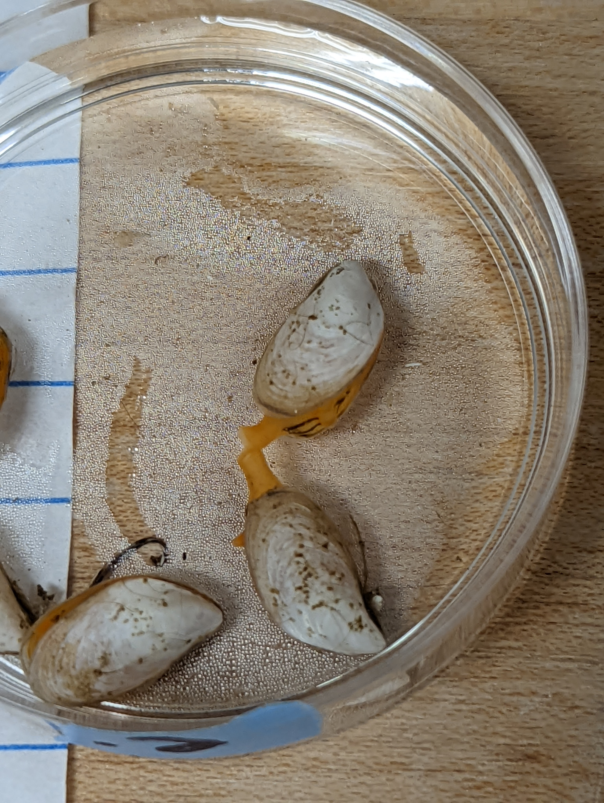
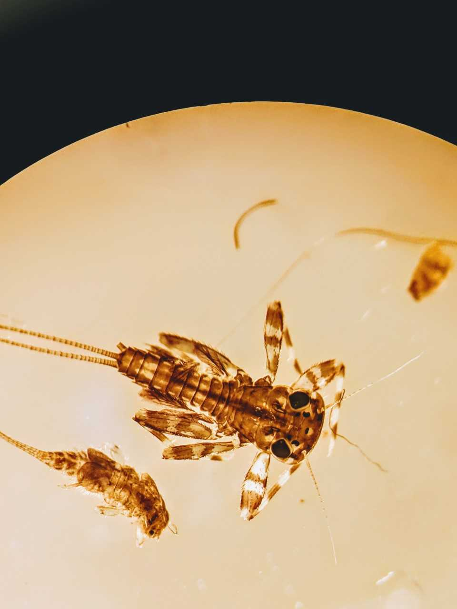
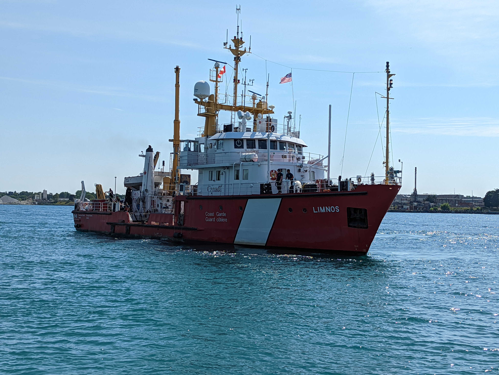
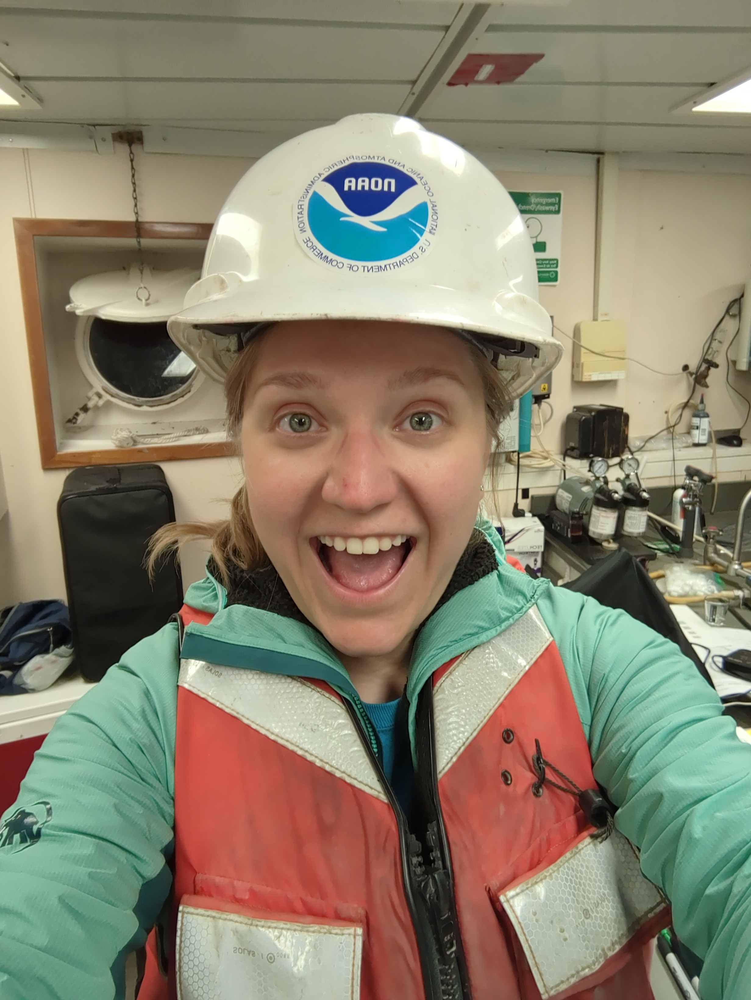

```{r setup, include=FALSE}
knitr::opts_chunk$set(echo = FALSE)
```


```{r fig.cap="Macrophyte survey in Muskegon Lake", out.extra="class=external"}
knitr::include_graphics("images/Macrophyte year 4 NE and Heritage 029_sharpened.png")
```

```{r fig.cap="Dreissena bugensis siphons", out.extra="class=external"}

```

```{r fig.cap="Stenacron spp. under a microscope", out.extra="class=external"}

```

```{r fig.cap="Canadian Coast Guard vessel Limnos", out.extra="class=external"}

```

```{r fig.cap="Night shift on the CCG Limnos", out.extra="class=external"}

```
